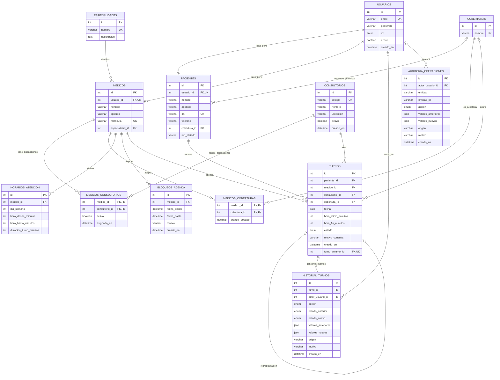

# Diagrama Entidad-Relación (DER)

## Modelo relacional objetivo

## Restricciones de integridad

- `MEDICOS_CONSULTORIOS` y `MEDICOS_COBERTURAS` tienen clave primaria compuesta por sus dos claves foráneas.
- `TURNOS.turno_anterior_id` es opcional y único: un turno puede tener como máximo un sucesor directo por reprogramación.
- `AUDITORIA_OPERACIONES.entidad` y `entidad_id` forman una referencia polimórfica y no una clave foránea SQL. La aplicación debe validar la entidad afectada.
- Un turno `CONFIRMADO` no puede solaparse temporalmente con otro turno confirmado del mismo médico ni del mismo consultorio. La integridad requiere validación transaccional y bloqueo de recursos; un índice por hora de inicio no cubre por sí solo intervalos de distinta duración.
- `CANCELADO` y `REPROGRAMADO` conservan su fila histórica, pero no ocupan disponibilidad futura.
- Los actores de historial/auditoría son opcionales para conservar los eventos aunque una cuenta relacionada deje de existir; cuando existe el usuario, la clave foránea se mantiene.
