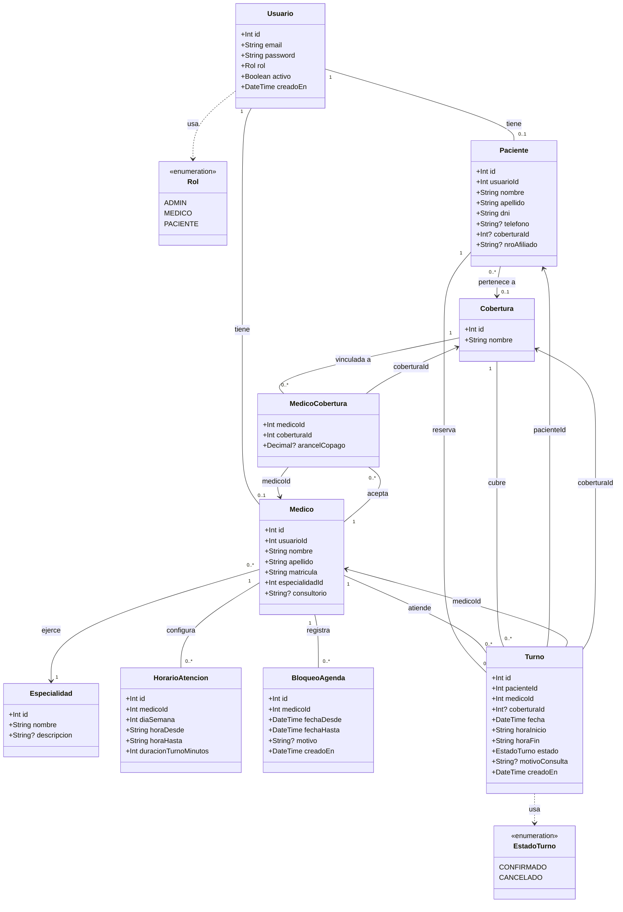

# Diagrama de Clases

## Modelo de Datos

```mermaid
classDiagram
    direction TB

    %% ──────────────────────────────────────────────
    %% ENUMERACIONES
    %% ──────────────────────────────────────────────
    class Rol {
        <<enumeration>>
        ADMIN
        MEDICO
        PACIENTE
    }

    class EstadoTurno {
        <<enumeration>>
        CONFIRMADO
        CANCELADO
    }

    %% ──────────────────────────────────────────────
    %% ENTIDADES DEL DOMINIO
    %% ──────────────────────────────────────────────
    class Usuario {
        +Int id
        +String email
        +String password
        +Rol rol
        +Boolean activo
        +DateTime creadoEn
    }

    class Paciente {
        +Int id
        +Int usuarioId
        +String nombre
        +String apellido
        +String dni
        +String? telefono
        +Int? coberturaId
        +String? nroAfiliado
    }

    class Medico {
        +Int id
        +Int usuarioId
        +String nombre
        +String apellido
        +String matricula
        +Int especialidadId
        +String? consultorio
    }

    class Especialidad {
        +Int id
        +String nombre
        +String? descripcion
    }

    class Cobertura {
        +Int id
        +String nombre
    }

    class MedicoCobertura {
        +Int medicoId
        +Int coberturaId
        +Decimal? arancelCopago
    }

    class HorarioAtencion {
        +Int id
        +Int medicoId
        +Int diaSemana
        +String horaDesde
        +String horaHasta
        +Int duracionTurnoMinutos
    }

    class BloqueoAgenda {
        +Int id
        +Int medicoId
        +DateTime fechaDesde
        +DateTime fechaHasta
        +String? motivo
        +DateTime creadoEn
    }

    class Turno {
        +Int id
        +Int pacienteId
        +Int medicoId
        +Int? coberturaId
        +DateTime fecha
        +String horaInicio
        +String horaFin
        +EstadoTurno estado
        +String? motivoConsulta
        +DateTime creadoEn
    }

    %% ──────────────────────────────────────────────
    %% RELACIONES ENTRE ENTIDADES
    %% ──────────────────────────────────────────────
    Usuario "1" -- "0..1" Paciente : tiene
    Usuario "1" -- "0..1" Medico : tiene
    Usuario ..> Rol : usa

    Paciente "0..*" --> "0..1" Cobertura : pertenece a
    Paciente "1" -- "0..*" Turno : reserva

    Medico "0..*" --> "1" Especialidad : ejerce
    Medico "1" -- "0..*" HorarioAtencion : configura
    Medico "1" -- "0..*" BloqueoAgenda : registra
    Medico "1" -- "0..*" Turno : atiende
    Medico "1" -- "0..*" MedicoCobertura : acepta

    Cobertura "1" -- "0..*" MedicoCobertura : vinculada a
    Cobertura "1" -- "0..*" Turno : cubre

    MedicoCobertura --> Medico : medicoId
    MedicoCobertura --> Cobertura : coberturaId

    Turno ..> EstadoTurno : usa
    Turno --> Paciente : pacienteId
    Turno --> Medico : medicoId
    Turno --> Cobertura : coberturaId
```