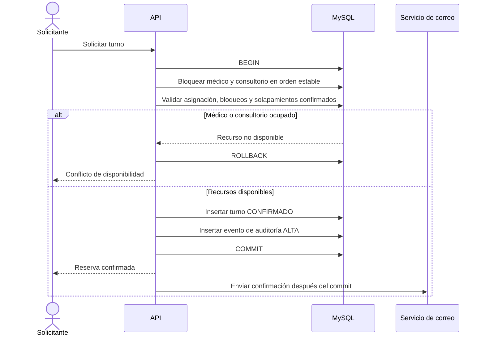
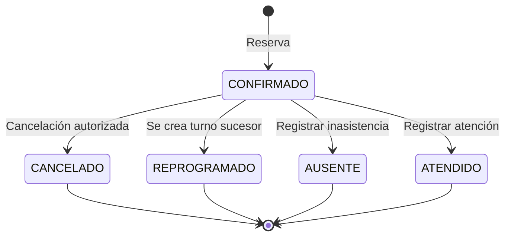

# Flujos Críticos de Turnos

## Reserva concurrente



## Cancelación y liberación

```mermaid
sequenceDiagram
    actor Operador
    participant API
    participant DB as MySQL

    Operador->>API: Cancelar turno
    API->>DB: BEGIN
    API->>DB: Leer turno y bloquear médico/consultorio en orden estable
    API->>DB: Validar propiedad, permisos y ventana de cancelación
    alt Operación no autorizada o turno no cancelable
        API->>DB: ROLLBACK
        API-->>Operador: Rechazar operación
    else Cancelación permitida
        API->>DB: Cambiar estado a CANCELADO
        API->>DB: Insertar evento con actor, motivo y snapshots
        API->>DB: COMMIT
        Note over DB: CANCELADO deja de ocupar disponibilidad; el turno permanece
        API-->>Operador: Cancelación confirmada
    end
```

## Reprogramación atómica

```mermaid
sequenceDiagram
    actor Operador
    participant API
    participant DB as MySQL

    Operador->>API: Reprogramar turno a nueva franja
    API->>DB: BEGIN
    API->>DB: Bloquear recursos anteriores y nuevos en orden estable
    API->>DB: Validar turno actual y disponibilidad destino
    alt Destino no disponible
        API->>DB: ROLLBACK
        API-->>Operador: Conflicto; turno original permanece confirmado
    else Destino disponible
        API->>DB: Marcar turno original REPROGRAMADO
        API->>DB: Crear nuevo turno CONFIRMADO vinculado al anterior
        API->>DB: Registrar eventos de ambos turnos
        API->>DB: COMMIT
        API-->>Operador: Reprogramación confirmada
    end
```

## Ciclo de vida


